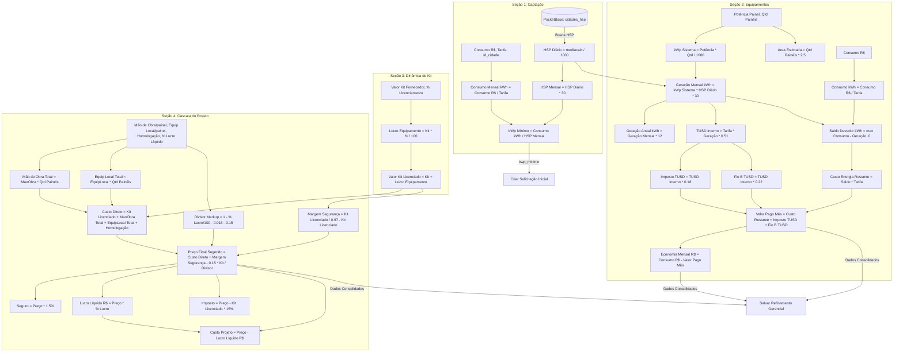

# Relatório de Auditoria e Análise de Cálculos do Backend

Este documento apresenta uma análise profunda de todos os cálculos, fórmulas matemáticas, regras de negócio e transformações numéricas implementados no backend do sistema de orçamentos solares.

---

## Diagrama Geral do Fluxo de Dados e Cálculos

O fluxo do sistema é dividido em 4 seções sequenciais, além de funções auxiliares de persistência e formatação:



---

# 1. Formatação de Valores Monetários (`formatarMoeda`)

## Objetivo de Negócio
Padronizar todos os valores numéricos que representam quantias monetárias ou decimais financeiros com no máximo duas casas decimais, evitando erros de ponto flutuante do JavaScript no faturamento e visualização.

## Localização
* **Arquivo:** [calculos.service.ts](file:///C:/Users/gabri/Documents/orcamentos_solar/backend/src/services/calculos.service.ts)
* **Classe:** `CalculosService`
* **Método/Função:** `formatarMoeda` (Linhas 18-20)

## Código Original
```typescript
  private formatarMoeda(valor: number): number {
    return Number(valor.toFixed(2));
  }
```

## Fórmula Matemática
$$Formatado(V) = \frac{\lfloor V \times 100 + 0.5 \rfloor}{100}$$

*(Nota: Internamente usa a função nativa `toFixed(2)` do JavaScript para arredondamento comercial e depois converte de volta para `number`)*.

## Entradas
| Variável | Tipo | Descrição |
| :--- | :--- | :--- |
| `valor` | `number` | Valor numérico bruto a ser formatado |

## Processo de Cálculo
1. O método recebe um `number` genérico.
2. Aplica `.toFixed(2)`, que arredonda o valor para duas casas decimais e o converte em `string`.
3. Aplica `Number()` para converter a `string` de volta ao tipo `number`.

## Exemplo Prático
Seja `valor = 15324.5678`:
* `valor.toFixed(2)` resulta em `"15324.57"`.
* `Number("15324.57")` resulta em `15324.57`.

## Dependências
Variáveis financeiras internas calculadas por outros métodos.

## Possíveis Problemas
* **Valores Nulos/Indefinidos:** Se for passado `null`, `undefined` ou um parâmetro que avalie para `NaN`, a chamada `valor.toFixed(2)` causará um erro de execução do tipo `TypeError: Cannot read properties of null (reading 'toFixed')` ou gerará `NaN`.
* **Arredondamento de Ponto Flutuante:** Devido à aritmética do padrão IEEE 754, dízimas de frações binárias podem arredondar de forma inconsistente em casos raros de final `.005` (ex: `1.005.toFixed(2)` retorna `"1.00"` em vez de `"1.01"` em alguns motores JS).

## Validação
✅ **Correto** (Desde que os parâmetros de entrada sejam devidamente tipados e não-nulos).

## Impacto no Sistema
Afeta todas as rotas e respostas do sistema. Garante que os valores salvos no PocketBase e exibidos no frontend estejam limpos de dízimas flutuantes (ex: `25000.000000000004`).

---

# 2. Dimensionamento Mínimo (Seção 1: Captação)

## Objetivo de Negócio
Estimar a potência mínima recomendada do sistema solar (em kWp) para suprir a necessidade energética do cliente com base no seu histórico de consumo financeiro mensal (R$) e no potencial de irradiação solar (HSP) da sua cidade.

## Localização
* **Arquivo:** [calculos.service.ts](file:///C:/Users/gabri/Documents/orcamentos_solar/backend/src/services/calculos.service.ts)
* **Classe:** `CalculosService`
* **Método/Função:** `calcularDimensionamentoMinimo` (Linhas 22-47) e `criarSolicitacaoInicial` (Linhas 179-202)

## Código Original
*(De `calcularDimensionamentoMinimo`)*:
```typescript
    const consumo_mensal_kwh = consumo_mes / valor_tarifa;
    const record = await pb.collection('cidades_hsp').getOne(id_cidade);

    if (!record) {
      throw new Error('HSP não encontrado para esta localidade');
    }

    const mediacalc = record.mediacalc / 1000;
    const hsp_mensal = mediacalc * 30;
    const kwp_minimo = consumo_mensal_kwh / hsp_mensal;
```

## Fórmula Matemática
1. Consumo mensal estimado em kWh:
$$ConsumoMensalKWh = \frac{ConsumoMes}{ValorTarifa}$$

2. Horas de Sol Pleno (HSP) Diárias:
$$HSPDiario = \frac{Record.MediaCalc}{1000}$$

3. HSP Mensal Acumulado (baseado em 30 dias):
$$HSPMensal = HSPDiario \times 30$$

4. Potência Mínima (kWp Mínimo):
$$KWpMinimo = \frac{ConsumoMensalKWh}{HSPMensal} = \frac{\frac{ConsumoMes}{ValorTarifa}}{\frac{Record.MediaCalc}{1000} \times 30}$$

## Entradas
| Variável | Tipo | Origem | Descrição |
| :--- | :--- | :--- | :--- |
| `consumo_mes` | `number` | Entrada do Usuário | Valor bruto da conta de luz em R$ |
| `valor_tarifa` | `number` | Entrada do Usuário | Tarifa da concessionária local em R$/kWh |
| `id_cidade` | `string` | Entrada do Usuário | ID identificador da cidade no PocketBase |
| `record.mediacalc` | `number` | Banco de Dados (`cidades_hsp`) | HSP diário médio anual da localidade em Wh/m² |

## Processo de Cálculo
1. Divide o valor financeiro da conta de luz (`consumo_mes`) pelo valor da tarifa energética (`valor_tarifa`) para obter a quantidade física consumida em kWh.
2. Consulta o banco PocketBase para obter o HSP médio da cidade, dividindo o campo `mediacalc` por 1000 para converter de Wh/m² para kWh/m²/dia (horas equivalentes de sol pleno).
3. Multiplica o HSP diário por 30 para estimar a irradiação mensal total.
4. Divide o consumo mensal pelo HSP mensal acumulado para obter o tamanho mínimo do sistema fotovoltaico (em kWp).

## Exemplo Prático
* `consumo_mes = 850.00` R$
* `valor_tarifa = 0.85` R$/kWh
* `record.mediacalc = 4276` (Ipameri, GO)

**Cálculos:**
1. $ConsumoMensalKWh = 850 / 0.85 = 1000 \text{ kWh}$
2. $HSPDiario = 4276 / 1000 = 4.276 \text{ horas/dia}$
3. $HSPMensal = 4.276 \times 30 = 128.28 \text{ horas/mês}$
4. $KWpMinimo = 1000 / 128.28 = 7.795 \text{ kWp}$

**Resultados Formatados:**
* `consumo_mensal_kwh = 1000`
* `mediacalc = 4.276`
* `hsp_mensal = 128.28`
* `kwp_minimo = 7.80`

## Dependências
* Tabela de Cidades e HSP do PocketBase (`cidades_hsp`).

## Possíveis Problemas
* **Divisão por Zero:** Se `valor_tarifa` for `0` ou não fornecido, o consumo resultará em `Infinity`. Se o HSP da cidade (`mediacalc`) for `0` (ou o registro estiver corrompido), o `hsp_mensal` será `0`, provocando divisão por zero no cálculo do `kwp_minimo` (`Infinity`).
* **Valores Nulos/NaN:** Se o frontend enviar campos vazios, a conta resultará em `NaN`.
* **Inconsistência de Média Mensal:** O cálculo assume um mês padrão fixo de 30 dias para todas as épocas do ano, desconsiderando sazonalidades e meses de 28/31 dias.

## Validação
⚠️ **Revisar** (Embora a matemática básica esteja correta, há falta de proteção contra tarifa igual a zero e HSP zero nas funções).

## Impacto no Sistema
Afeta a etapa inicial de captação e triagem do cliente. Uma falha ou instabilidade de dados neste endpoint impossibilita a criação correta de propostas comerciais na plataforma.

---

# 3. Potência Real do Sistema (`calcularSistemaReal`)

## Objetivo de Negócio
Calcular a potência de geração real instalada no telhado (em kWp), com base na quantidade física de módulos (painéis) selecionada e na potência individual de fabricação de cada painel (em Watts).

## Localização
* **Arquivo:** [calculos.service.ts](file:///C:/Users/gabri/Documents/orcamentos_solar/backend/src/services/calculos.service.ts)
* **Classe:** `CalculosService`
* **Método/Função:** `calcularSistemaReal` (Linhas 49-53)

## Código Original
```typescript
  calcularSistemaReal(input: SistemaRealInput): SistemaRealOutput {
    const { potencia_painel, quantidade_paineis } = input;
    const kwp_sistema = (potencia_painel * quantidade_paineis) / 1000;
    return { kwp_sistema: this.formatarMoeda(kwp_sistema) };
  }
```

## Fórmula Matemática
$$KWpSistema = \frac{PotenciaPainel \times QuantidadePaineis}{1000}$$

## Entradas
| Variável | Tipo | Origem | Descrição |
| :--- | :--- | :--- | :--- |
| `potencia_painel` | `number` | Entrada do Usuário (Painel) | Potência nominal do painel solar em Watts (ex: 550) |
| `quantidade_paineis` | `number` | Entrada do Usuário | Quantidade física de painéis a serem instalados |

## Processo de Cálculo
1. Multiplica a potência nominal unitária em Watts pela quantidade de painéis.
2. Divide por 1000 para converter o resultado de Watts-pico (Wp) para Quilowatts-pico (kWp).
3. Formata para duas casas decimais.

## Exemplo Prático
* `potencia_painel = 605` W
* `quantidade_paineis = 24` unidades

**Cálculo:**
$$KWpSistema = \frac{605 \times 24}{1000} = \frac{14520}{1000} = 14.52 \text{ kWp}$$

## Dependências
Seleção de equipamentos oriunda do catálogo ou dimensionamento técnico feito no frontend.

## Possíveis Problemas
* **Valores Negativos ou Nulos:** Se forem inseridos valores negativos ou vazios, a potência nominal resultará em valores absurdos ou `NaN`.

## Validação
✅ **Correto**

## Impacto no Sistema
Fornece o tamanho real do sistema solar planejado. É o dado de partida para todas as estimativas de geração de energia, payback e custos diretos.

---

# 4. Geração Estimada e Retorno Financeiro (`calcularGeracaoERetorno`)

## Objetivo de Negócio
Simular o rendimento do sistema solar instalado em termos de volume de energia gerada (kWh) e estimar o impacto financeiro (economia, redução de custos e tempo de retorno do investimento) aplicando as regras brasileiras de compensação de energia solar (incluindo cobranças de TUSD/Fio B e tributações).

## Localização
* **Arquivo:** [calculos.service.ts](file:///C:/Users/gabri/Documents/orcamentos_solar/backend/src/services/calculos.service.ts)
* **Classe:** `CalculosService`
* **Método/Função:** `calcularGeracaoERetorno` (Linhas 55-128)

## Código Original
```typescript
    const hsp_diario = mediacalc; 
    
    // Média do Mês (Valor real com decimais)
    const media_mes_kwh = kwp_sistema * hsp_diario * 30;
    const geracao_mensal_kwh = Math.round(media_mes_kwh); 
    const geracao_anual_kwh = media_mes_kwh * 12;

    // 2. Área Estimada (Fator 2.5 solicitado)
    const area_estimada = (quantidade_paineis || 0) * 2.5;

    // 3. Economia e Valor Pago (Nova Regra baseada em TUSD)
    const tusd_interno = valor_tarifa * media_mes_kwh * 0.51;
    const imposto_faturamento = tusd_interno * 0.18;
    const fio_b_faturamento = tusd_interno * 0.22;
    
    const consumo_kwh = consumo_mes_rs / valor_tarifa;
    const saldo_devedor_kwh = Math.max(consumo_kwh - media_mes_kwh, 0);
    const custo_energia_restante = saldo_devedor_kwh * valor_tarifa;

    const valor_pago_mes = this.formatarMoeda(custo_energia_restante + imposto_faturamento + fio_b_faturamento);
    const valor_pago_ano = this.formatarMoeda(valor_pago_mes * 12);

    // 4. Redução Real e Retorno Financeiro
    const economia_mensal_rs = this.formatarMoeda(consumo_mes_rs - valor_pago_mes);
    const economia_anual_rs = this.formatarMoeda(economia_mensal_rs * 12);
    const porcentagem_reducao = Number((economia_mensal_rs / (consumo_mes_rs || 1)).toFixed(2));

    // Payback = Valor Investido / Economia Mensal
    let tempo_retorno = "N/A";
    if (economia_mensal_rs > 0 && valor_investido > 0) {
      const mesesTotal = valor_investido / economia_mensal_rs;
      const anos = Math.floor(mesesTotal / 12);
      const mesesRemaining = Math.ceil(mesesTotal % 12); 
      // ... monta string
```

## Fórmula Matemática

1. Volume de Geração Mensal Real:
$$MediaMesKWh = KWpSistema \times HSPDiario \times 30$$
$$GeracaoMensalKWh = \text{round}(MediaMesKWh)$$

2. Volume de Geração Anual:
$$GeracaoAnualKWh = MediaMesKWh \times 12$$

3. Área Física Ocupada (Fator $2.5 \text{ m}^2$ por painel):
$$AreaEstimada = QuantidadePaineis \times 2.5$$

4. Encargos Regulatórios TUSD (Lei 14.300 / Regras de Distribuição):
$$TUSDInterno = ValorTarifa \times MediaMesKWh \times 0.51$$
$$ImpostoTUSD = TUSDInterno \times 0.18$$
$$FioBTUSD = TUSDInterno \times 0.22$$

5. Custos da Fatura Pós-Instalação:
$$ConsumoKWh = \frac{ConsumoMesRs}{ValorTarifa}$$
$$SaldoDevedorKWh = \max(ConsumoKWh - MediaMesKWh, 0)$$
$$CustoEnergiaRestante = SaldoDevedorKWh \times ValorTarifa$$
$$ValorPagoMes = CustoEnergiaRestante + ImpostoTUSD + FioBTUSD$$
$$ValorPagoAno = ValorPagoMes \times 12$$

6. Economia Financeira:
$$EconomiaMensalR\$ = ConsumoMesRs - ValorPagoMes$$
$$EconomiaAnualR\$ = EconomiaMensalR\$ \times 12$$
$$PorcentagemReducao = \frac{EconomiaMensalR\$}{\max(ConsumoMesRs, 1)}$$

7. Tempo de Retorno de Investimento (Payback):
$$MesesTotal = \frac{ValorInvestido}{EconomiaMensalR\$}$$
$$Anos = \lfloor \frac{MesesTotal}{12} \rfloor$$
$$MesesRestantes = \lceil (MesesTotal \pmod{12}) \rceil$$

## Entradas
| Variável | Tipo | Origem | Descrição |
| :--- | :--- | :--- | :--- |
| `kwp_sistema` | `number` | Método anterior | Potência em kWp calculada do sistema real |
| `mediacalc` | `number` | Banco de Dados / Front | HSP diário (ex: 4.276) |
| `valor_tarifa` | `number` | Entrada do Usuário | Valor da tarifa por kWh (R$) |
| `consumo_mes_rs` | `number` | Entrada do Usuário | Valor atual pago na conta de luz em R$ |
| `valor_investido` | `number` | Entrada do Usuário | Valor comercial do orçamento cobrado do cliente |
| `quantidade_paineis` | `number` | Entrada do Usuário | Quantidade física de painéis selecionados |

## Processo de Cálculo
1. Determina a geração teórica mensal (`media_mes_kwh`) e a arredonda para salvar a geração física (`geracao_mensal_kwh`).
2. Aplica o fator multiplicador de $2.5\text{ m}^2$ sobre o número de painéis para obter a área de telhado necessária.
3. Calcula a tarifa de uso do sistema de distribuição (TUSD Interno), aplicando o fator regulatório de 51% sobre a energia gerada valorada à tarifa cheia.
4. Sobre a TUSD, calcula o Fio B (22%) e tributos regulatórios (18%).
5. Avalia se a geração cobre totalmente a demanda. Se o consumo em kWh exceder a geração mensal, calcula o custo residual cobrado pela concessionária.
6. Soma o custo residual com a tributação do Fio B e impostos sobre a TUSD, resultando no novo valor pago mensal.
7. Compara o novo valor pago com o antigo para determinar a economia em reais, a porcentagem de redução de custos e calcula o payback amortizado.

## Exemplo Prático
* `kwp_sistema = 14.52` kWp
* `mediacalc = 4.276` HSP (Ipameri)
* `valor_tarifa = 0.85` R$/kWh
* `consumo_mes_rs = 1500.00` R$
* `valor_investido = 50000.00` R$
* `quantidade_paineis = 24`

**Cálculos Passo a Passo:**
1. **Geração:**
   * $MediaMesKWh = 14.52 \times 4.276 \times 30 = 1861.77 \text{ kWh}$
   * $GeracaoMensalKWh = 1862 \text{ kWh}$ (Arredondado)
   * $GeracaoAnualKWh = 1861.77 \times 12 = 22341.24 \text{ kWh}$
2. **Área Ocupada:**
   * $AreaEstimada = 24 \times 2.5 = 60 \text{ m}^2$
3. **Encargos TUSD sobre Geração:**
   * $TUSDInterno = 0.85 \times 1861.77 \times 0.51 = 807.01 \text{ R\$}$
   * $ImpostoTUSD = 807.01 \times 0.18 = 145.26 \text{ R\$}$
   * $FioBTUSD = 807.01 \times 0.22 = 177.54 \text{ R\$}$
4. **Saldo e Fatura Pós-Solar:**
   * $ConsumoKWh = 1500 / 0.85 = 1764.71 \text{ kWh}$
   * Como a geração (1861.77 kWh) é maior que o consumo (1764.71 kWh), o $SaldoDevedorKWh = 0$.
   * $CustoEnergiaRestante = 0 \text{ R\$}$.
   * $ValorPagoMes = 0 + 145.26 + 177.54 = 322.80 \text{ R\$}$
   * $ValorPagoAno = 322.80 \times 12 = 3873.60 \text{ R\$}$
5. **Economia e Payback:**
   * $EconomiaMensal = 1500 - 322.80 = 1177.20 \text{ R\$}$
   * $EconomiaAnual = 1177.20 \times 12 = 14126.40 \text{ R\$}$
   * $PorcentagemReducao = 1177.20 / 1500 = 78\% \text{ (ou 0.78)}$
   * $MesesTotal = 50000 / 1177.20 = 42.47 \text{ meses}$
   * $Anos = \lfloor 42.47 / 12 \rfloor = 3 \text{ anos}$
   * $MesesRestantes = \lceil 42.47 \pmod{12} \rceil = \lceil 6.47 \rceil = 7 \text{ meses}$
   * **Payback formatado:** `"3 anos e 7 meses"`

## Dependências
Nenhuma externa além dos parâmetros de entrada da API.

## Possíveis Problemas
* **Propagação de NaN (Erro Crítico Identificado nos Testes):** Se `consumo_mes_rs` for nulo ou indefinido (como ocorre no teste unitário do backend), a divisão `consumo_mes_rs / valor_tarifa` gera `NaN`. Esse `NaN` se propaga em todas as equações subsequentes e resulta em campos `null` na resposta da API (`valor_pago_mes = null`, `economia_mensal_rs = null`, etc.), quebrando a exibição no front.
* **Bug Visual de Payback com Arredondamento Teto:** O uso de `Math.ceil(mesesTotal % 12)` para calcular os meses restantes introduz um bug conceitual. Se `mesesTotal` for `11.9` meses, o cálculo de `mesesTotal % 12` resulta em `11.9`, que sob `Math.ceil` se torna `12`. O sistema exibirá `"0 anos e 12 meses"` ou `"1 ano e 12 meses"`, em vez de ajustar para `"1 ano"` ou `"2 anos"`.
* **Incompatibilidade de Escala de Unidade (HSP):** O parâmetro `mediacalc` nesta função é esperado como valor decimal do HSP (ex: `4.276`), mas os testes integrados e o arquivo de simulação enviam `mediacalc` multiplicado por 1000 (ex: `5000`). Isso causa cálculos com geração de energia superestimada em 1000 vezes, o que gerou falha no teste comercial.
* **Ignora Custos de Conexão Física (Custo de Disponibilidade):** O cálculo ignora o padrão elétrico (`padrao: Monofásico / Bifásico / Trifásico`). Pela regulamentação brasileira (Resolução ANEEL), há uma taxa mínima cobrada independentemente da geração (30, 50 ou 100 kWh), que deveria limitar o valor mínimo pago da fatura.

## Validação
❌ **Possível erro** (Devido à falha crítica de unidade do HSP na integração com testes/simulações e à quebra com `NaN` se o consumo não for enviado).

## Impacto no Sistema
Essa fórmula é a base dos argumentos comerciais do vendedor. Se estiver incorreta ou superestimada (pelo erro do HSP * 1000), o cliente receberá um relatório financeiro com economia inflada ou tempo de retorno irreal.

---

# 5. Licenciamento do Kit (Seção 3: Dinâmica do Kit)

## Objetivo de Negócio
Definir a margem de acréscimo (markup) aplicada sobre o kit gerador bruto do fornecedor, precificando o valor de venda intermediário (kit licenciado) que será repassado na cascata de faturamento do projeto.

## Localização
* **Arquivo:** [calculos.service.ts](file:///C:/Users/gabri/Documents/orcamentos_solar/backend/src/services/calculos.service.ts)
* **Classe:** `CalculosService`
* **Método/Função:** `calcularLicenciamentoKit` (Linhas 131-140)

## Código Original
```typescript
  calcularLicenciamentoKit(input: LicenciamentoKitInput): LicenciamentoKitOutput {
    const { valorKit, valorPorcentagem } = input;
    const lucroEquipamentoFinal = valorKit * (valorPorcentagem / 100);
    const valorKitLicenciado = valorKit + lucroEquipamentoFinal;

    return {
      lucroEquipamentoFinal: this.formatarMoeda(lucroEquipamentoFinal),
      valorKitLicenciado: this.formatarMoeda(valorKitLicenciado)
    };
  }
```

## Fórmula Matemática
$$LucroEquipamentoFinal = ValorKit \times \frac{ValorPorcentagem}{100}$$
$$ValorKitLicenciado = ValorKit + LucroEquipamentoFinal = ValorKit \times (1 + \frac{ValorPorcentagem}{100})$$

## Entradas
| Variável | Tipo | Origem | Descrição |
| :--- | :--- | :--- | :--- |
| `valorKit` | `number` | Entrada do Usuário | Custo bruto original do kit solar (fornecedor) em R$ |
| `valorPorcentagem` | `number` | Entrada do Usuário | Percentual manual de markup/lucro sobre o kit (ex: 10) |

## Processo de Cálculo
1. Multiplica o preço de custo do kit pelo percentual de markup inserido e divide por 100.
2. Soma o lucro calculado ao valor original para atingir o valor faturado do kit licenciado.
3. Formata ambas as variáveis monetárias.

## Exemplo Prático
* `valorKit = 20000.00` R$
* `valorPorcentagem = 12` %

**Cálculos:**
* $LucroEquipamentoFinal = 20000 \times 0.12 = 2400 \text{ R\$}$
* $ValorKitLicenciado = 20000 + 2400 = 22400 \text{ R\$}$

## Dependências
Nenhuma.

## Possíveis Problemas
* **Valores Negativos:** Aceita percentuais negativos sem validação, o que reduziria de forma inadequada o preço do kit.

## Validação
✅ **Correto**

## Impacto no Sistema
Determina o custo real do equipamento solar a ser integrado no cálculo de faturamento final.

---

# 6. Precificação Final por Markup Divisor (Seção 4: Cascata do Projeto)

## Objetivo de Negócio
Calcular o preço final sugerido de venda para o cliente final usando a metodologia de **Markup Divisor**, garantindo que todos os custos diretos, margem financeira de segurança, impostos (15% sobre margem real) e seguros (1.5% do preço final) sejam embutidos e pagos de forma retroativa pela venda, preservando o lucro líquido percentual desejado sobre o total.

## Localização
* **Arquivo:** [calculos.service.ts](file:///C:/Users/gabri/Documents/orcamentos_solar/backend/src/services/calculos.service.ts)
* **Classe:** `CalculosService`
* **Método/Função:** `calcularPrecoFinal` (Linhas 143-177)

## Código Original
```typescript
    const valorMaoDeObraTotal = valorMaoDeObra * (quantidade_paineis || 0);
    const valorEquipamentoLocalTotal = valorEquipamentoLocal * (quantidade_paineis || 0);

    const custoDireto = valorKitLicenciado + valorMaoDeObraTotal + valorEquipamentoLocalTotal + valorHomologacao;
    const margemSeguranca = (valorKitLicenciado / 0.97) - valorKitLicenciado;
    const divisor = 1 - (porcentagemLucroLiquido / 100) - 0.015 - 0.15;
    const precoFinalSugerido = (custoDireto + margemSeguranca - (0.15 * valorKitLicenciado)) / divisor;

    const seguro = precoFinalSugerido * 0.015;
    const lucroLiquidoRs = precoFinalSugerido * (porcentagemLucroLiquido / 100);
    const imposto = (precoFinalSugerido - valorKitLicenciado) * 0.15;
    const custoProjeto = precoFinalSugerido - lucroLiquidoRs;
```

## Fórmula Matemática

1. Mão de Obra e Equipamento Local Totais:
$$ValorMaoDeObraTotal = ValorMaoDeObra \times QuantidadePaineis$$
$$ValorEquipamentoLocalTotal = ValorEquipamentoLocal \times QuantidadePaineis$$

2. Custo Direto Agrupado:
$$CustoDireto = ValorKitLicenciado + ValorMaoDeObraTotal + ValorEquipamentoLocalTotal + ValorHomologacao$$

3. Margem de Segurança Financeira (3% sobre o Kit Licenciado):
$$MargemSeguranca = \frac{ValorKitLicenciado}{0.97} - ValorKitLicenciado \approx ValorKitLicenciado \times 0.0309278$$

4. Divisor de Markup:
$$Divisor = 1 - \frac{PorcentagemLucroLiquido}{100} - 0.015 - 0.15$$

5. Preço Final Sugerido:
$$PrecoFinalSugerido = \frac{CustoDireto + MargemSeguranca - (0.15 \times ValorKitLicenciado)}{Divisor}$$

6. Fatias do Faturamento:
$$Seguro = PrecoFinalSugerido \times 0.015$$
$$LucroLiquidoRs = PrecoFinalSugerido \times \frac{PorcentagemLucroLiquido}{100}$$
$$Imposto = (PrecoFinalSugerido - ValorKitLicenciado) \times 0.15$$
$$CustoProjeto = PrecoFinalSugerido - LucroLiquidoRs$$

*(Prova Real: $PrecoFinalSugerido = CustoDireto + MargemSeguranca + Seguro + Imposto + LucroLiquidoRs$)*.

## Entradas
| Variável | Tipo | Origem | Descrição |
| :--- | :--- | :--- | :--- |
| `valorKitLicenciado` | `number` | Seção 3 | Custo do kit acrescido do licenciamento interno |
| `valorMaoDeObra` | `number` | Entrada do Usuário | Custo unitário de instalação por painel (R$) |
| `valorEquipamentoLocal` | `number` | Entrada do Usuário | Custo unitário de materiais locais por painel (R$) |
| `valorHomologacao` | `number` | Entrada do Usuário | Custo fixo de homologação do engenheiro (R$) |
| `porcentagemLucroLiquido` | `number` | Entrada do Usuário | Percentual de lucro líquido final do integrador (ex: 15) |
| `quantidade_paineis` | `number` | Entrada do Usuário | Quantidade física de painéis selecionados |

## Processo de Cálculo
1. Converte mão de obra e materiais locais de valores unitários para totais do projeto multiplicando pelo número de painéis.
2. Totaliza os custos físicos diretos (`custoDireto`).
3. Calcula a margem de segurança financeira dividindo o valor do kit por 0.97 (representando o impacto financeiro de perdas).
4. Subtrai do custo total uma compensação tributária baseada no kit já faturado, dividindo tudo pelo divisor do markup que já desconta seguros (1.5%), lucro líquido (%) e impostos (15%).
5. Divide o montante para achar o `precoFinalSugerido`.
6. Encontra as fatias correspondentes a seguro, lucro em reais, impostos e custo líquido do projeto.

## Exemplo Prático
* `valorKitLicenciado = 11000.00` R$
* `valorMaoDeObra = 100.00` R$ por painel
* `valorEquipamentoLocal = 50.00` R$ por painel
* `valorHomologacao = 1000.00` R$
* `quantidade_paineis = 20` painéis
* `porcentagemLucroLiquido = 15` %

**Cálculos:**
1. **Custos:**
   * $MaoObraTotal = 100 \times 20 = 2000 \text{ R\$}$
   * $EquipLocalTotal = 50 \times 20 = 1000 \text{ R\$}$
   * $CustoDireto = 11000 + 2000 + 1000 + 1000 = 15000 \text{ R\$}$
2. **Margens e Markup:**
   * $MargemSeguranca = (11000 / 0.97) - 11000 = 11340.21 - 11000 = 340.21 \text{ R\$}$
   * $Divisor = 1 - 0.15 - 0.015 - 0.15 = 0.685$
   * $PrecoFinalSugerido = \frac{15000 + 340.21 - (0.15 \times 11000)}{0.685} = \frac{15340.21 - 1650}{0.685} = \frac{13690.21}{0.685} = 19985.71 \text{ R\$}$
3. **Fatias de Desdobramento:**
   * $Seguro = 19985.71 \times 0.015 = 299.79 \text{ R\$}$
   * $LucroLiquidoRs = 19985.71 \times 0.15 = 2997.86 \text{ R\$}$
   * $Imposto = (19985.71 - 11000) \times 0.15 = 1347.86 \text{ R\$}$
   * $CustoProjeto = 19985.71 - 2997.86 = 16987.85 \text{ R\$}$

**Prova Real Matemática (Soma das partes):**
$$11000 + 2000 + 1000 + 1000 + 340.21 (\text{Margem}) + 299.79 (\text{Seguro}) + 1347.86 (\text{Imposto}) + 2997.86 (\text{Lucro}) = 19985.72 \text{ R\$}$$
*(A diferença de 1 centavo ocorre unicamente por arredondamentos decimais de ponto flutuante).*

## Dependências
Valor do Kit Licenciado e quantidade física de painéis.

## Possíveis Problemas
* **Divisão por Zero ou Preço Negativo (Risco Crítico):** Se o usuário desejar uma margem de lucro líquido muito alta, o divisor se aproxima de zero ou fica negativo.
  * O divisor é zero quando: $\text{Lucro \%} = 83.5\%$ (pois $1 - 0.835 - 0.015 - 0.15 = 0$).
  * Se a margem inserida for $\ge 83.5\%$, a plataforma tentará dividir por zero ou por um valor negativo, gerando um preço sugerido negativo ou tendendo ao infinito.
* **Bug Unitário de Painéis Omitidos (Falha de Teste Identificada):** O teste unitário do backend não envia a chave `quantidade_paineis` no corpo do teste. Como o código utiliza `quantidade_paineis || 0`, o sistema substitui por `0`, anulando completamente os custos de mão de obra e equipamento local da soma (`2000 * 0 = 0` e `500 * 0 = 0`). A soma do teste espera estes custos inteiros, o que gera uma falha exata de `R$ 2500` na asserção.

## Validação
❌ **Possível erro** (Devido à falha estrutural de falta de parâmetro de painéis nos testes e à vulnerabilidade de divisão por zero/valores negativos caso a margem passe de 83.5%).

## Impacto no Sistema
É o núcleo financeiro da proposta comercial. Determina a viabilidade da venda, o faturamento real e quanto de imposto/seguro será provisionado.

---

# Relatório Consolidado de Fórmulas

| Cálculo | Local | Fórmula Matemática | Status |
| :--- | :--- | :--- | :--- |
| **Formatação de Moeda** | `CalculosService.formatarMoeda` | $Formatado(V) = \text{round}(V, 2)$ | ✅ Correto |
| **Consumo Estimado (kWh)** | `CalculosService.calcularDimensionamentoMinimo` | $ConsumoMensalKWh = \frac{ConsumoMes}{ValorTarifa}$ | ⚠️ Revisar (Duplicado) |
| **HSP Diário** | `CalculosService.calcularDimensionamentoMinimo` | $HSPDiario = \frac{Record.MediaCalc}{1000}$ | ⚠️ Revisar (Duplicado) |
| **HSP Mensal** | `CalculosService.calcularDimensionamentoMinimo` | $HSPMensal = HSPDiario \times 30$ | ⚠️ Revisar (Duplicado) |
| **kWp Mínimo** | `CalculosService.calcularDimensionamentoMinimo` | $KWpMinimo = \frac{ConsumoMensalKWh}{HSPMensal}$ | ⚠️ Revisar (Duplicado) |
| **kWp Sistema Real** | `CalculosService.calcularSistemaReal` | $KWpSistema = \frac{PotenciaPainel \times QuantidadePaineis}{1000}$ | ✅ Correto |
| **Geração Estimada (kWh)** | `CalculosService.calcularGeracaoERetorno` | $MediaMes = KWpSistema \times HSPDiario \times 30$ | ⚠️ Revisar (Erro de Unidade) |
| **Área Estimada ($m^2$)** | `CalculosService.calcularGeracaoERetorno` | $AreaEstimada = QuantidadePaineis \times 2.5$ | ✅ Correto |
| **TUSD Interno** | `CalculosService.calcularGeracaoERetorno` | $TUSDInterno = ValorTarifa \times MediaMes \times 0.51$ | ✅ Correto |
| **Imposto s/ TUSD** | `CalculosService.calcularGeracaoERetorno` | $ImpostoTUSD = TUSDInterno \times 0.18$ | ✅ Correto |
| **Fio B s/ TUSD** | `CalculosService.calcularGeracaoERetorno` | $FioBTUSD = TUSDInterno \times 0.22$ | ✅ Correto |
| **Custo de Energia Restante** | `CalculosService.calcularGeracaoERetorno` | $Restante = \max(\frac{ConsumoR\$}{Tarifa} - MediaMes, 0) \times Tarifa$ | ❌ Possível erro (NaN) |
| **Valor Pago Pós-Solar** | `CalculosService.calcularGeracaoERetorno` | $PagoMes = Restante + ImpostoTUSD + FioBTUSD$ | ❌ Possível erro (NaN) |
| **Economia Mensal (R$)** | `CalculosService.calcularGeracaoERetorno` | $Economia = ConsumoR\$ - PagoMes$ | ❌ Possível erro (NaN) |
| **Redução (%)** | `CalculosService.calcularGeracaoERetorno` | $Reducao = \frac{Economia}{\max(ConsumoR\$, 1)}$ | ✅ Correto |
| **Tempo de Retorno (Payback)**| `CalculosService.calcularGeracaoERetorno` | $Anos = \lfloor \frac{Investido}{Economia \times 12} \rfloor$; $Meses = \lceil \frac{Investido}{Economia} \pmod{12} \rceil$ | ❌ Possível erro (Arredondamento) |
| **Lucro Licenciamento Kit** | `CalculosService.calcularLicenciamentoKit` | $LucroKit = Kit \times \frac{Porcentagem}{100}$ | ✅ Correto |
| **Kit Licenciado Final** | `CalculosService.calcularLicenciamentoKit` | $KitLicenciado = Kit + LucroKit$ | ✅ Correto |
| **Custo Direto do Projeto** | `CalculosService.calcularPrecoFinal` | $CustoDireto = KitLic + MaoObraTotal + EquipLocTotal + Homolog$ | ⚠️ Revisar (Qtd Painéis nula) |
| **Margem de Segurança (3%)** | `CalculosService.calcularPrecoFinal` | $MargemSeguranca = \frac{KitLic}{0.97} - KitLic$ | ✅ Correto |
| **Preço Sugerido de Venda** | `CalculosService.calcularPrecoFinal` | $PrecoFinal = \frac{CustoDireto + MargemSeguranca - 0.15 \times KitLic}{1 - \%Lucro - 0.015 - 0.15}$ | ❌ Possível erro (Div por zero) |
| **Distribuição: Seguro** | `CalculosService.calcularPrecoFinal` | $Seguro = PrecoFinal \times 0.015$ | ✅ Correto |
| **Distribuição: Lucro Líquido**| `CalculosService.calcularPrecoFinal` | $LucroRs = PrecoFinal \times \frac{\%Lucro}{100}$ | ✅ Correto |
| **Distribuição: Imposto** | `CalculosService.calcularPrecoFinal` | $Imposto = (PrecoFinal - KitLic) \times 0.15$ | ✅ Correto |
| **Custo Líquido Projeto** | `CalculosService.calcularPrecoFinal` | $CustoProj = PrecoFinal - LucroRs$ | ✅ Correto |

---

# Diagnósticos e Inconsistências Arquiteturais

## 1. Regras de Negócio e Cálculos Duplicados
* **Duplicação Estrita do Dimensionamento Mínimo:**
  Os métodos `calcularDimensionamentoMinimo` e `criarSolicitacaoInicial` duplicam exatamente a mesma lógica matemática de cálculo de consumo físico, busca de HSP diário e cálculo do `kwp_minimo`. 
  * *Risco:* Qualquer alteração de fator (como mudar a média de dias de 30 para o número real de dias do mês, ou incluir perdas do sistema) precisará ser alterada manualmente em ambos os métodos. Caso um seja esquecido, propostas criadas inicialmente e cálculos em tela divergirão.

## 2. Dependência de Cálculos Críticos no Frontend (Risco de Segurança)
* **Arquitetura de "Pass-Through" em `salvarRefinamentoGerencial`:**
  O método `salvarRefinamentoGerencial` aceita como entrada uma lista massiva de campos já calculados (`kwp_minimo`, `kwp_sistema`, `valor_kit_final`, `lucro_equipamento`, `seguro`, `custo_projeto`, `imposto`, `margem_seguranca`, `lucro_liquido_previsto`, `preco_final_venda`, `economia_mensal_rs`, etc.). 
  * O backend **não executa nenhuma validação ou recálculo desses dados**, apenas os salva diretamente no PocketBase (`payloadPocketBase`).
  * *Risco de Segurança:* Um usuário mal-intencionado pode interceptar a requisição ou manipular o console do navegador para forçar a gravação de dados inconsistentes (ex: alterar `preco_final_venda` para um valor inferior ou `lucro_liquido_previsto` inflado artificialmente). O backend aceitará e consolidará o orçamento adulterado no banco.

## 3. Cálculos Repetidos e Acoplamento
* **Multiplicação de Mão de Obra e Equipamento Local:**
  Os custos unitários `valorMaoDeObra` e `valorEquipamentoLocal` são multiplicados pela `quantidade_paineis` em `calcularPrecoFinal`, mas não há centralização sobre a contagem de módulos. Se o número de módulos for alterado sem atualizar essa chamada, os custos de mão de obra e equipamento local ficarão defasados.

## 4. Riscos de Divergência Futura
* **Valores Hardcoded:**
  Fatores tributários e operacionais (como imposto de 15%, seguro de 1.5% e margem financeira de 3% no Kit) estão gravados de forma direta (hardcoded) nas funções matemáticas. Caso o imposto municipal/federal mude, ou a corretora de seguros reajuste a taxa de 1.5% para 2.0%, toda a matemática de markup divisor precisará sofrer refatoração manual direto nas linhas de código do backend.

---

# Recomendações de Centralização e Correção

1. **Centralizar Dimensionamento Mínimo:**
   Extrair a lógica de cálculo de HSP e dimensionamento mínimo para um método privado ou classe utilitária (ex: `calcularDadosLocalidade(id_cidade, consumo, tarifa)`), de forma que tanto a rota de simulação instantânea quanto a de gravação inicial chamem o mesmo ponto único de verdade.
   
2. **Implementar Recálculo do Refinamento no Backend:**
   Em vez de aceitar faturas pré-calculadas pelo frontend na rota `/salvar-refinamento`, o frontend deveria enviar apenas os **parâmetros de base** (quantidade de painéis, potência, custos diretos e margens). O backend recalcularia toda a cascata financeira e de geração e salvaria os dados resultantes seguros.
   
3. **Mover Alíquotas para Configuração/Banco de Dados:**
   Tornar as taxas (imposto de 15%, seguro de 1.5%, margem de segurança de 3% e fator de área de 2.5) variáveis de configuração globais carregadas a partir de variáveis de ambiente (`.env`) ou tabelas de configurações no PocketBase.
   
4. **Resolver o Abismo de Escala do HSP:**
   Corrigir o teste unitário (`calculos.service.test.ts`) e o roteiro de simulação (`simulacao.ts`) para passar o valor HSP diário já convertido (como `5.0` em vez de `5000`), alinhando com a interface real da API.
   
5. **Prevenção de Divisão por Zero:**
   Incluir validações ativas nas entradas de tarifa e margens, rejeitando lucros líquidos que resultem em divisores nulos/negativos ($\ge 83.5\%$) com um erro amigável (`HTTP 400 - Parâmetro Inválido`).
